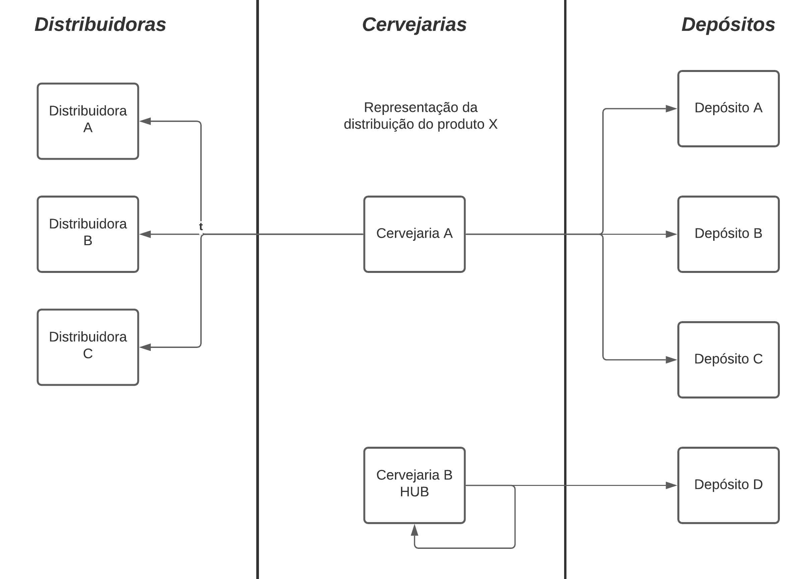
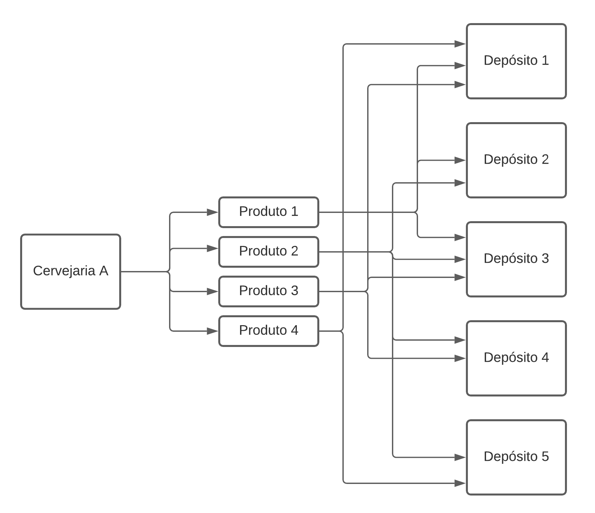

# EDSA - Efficient Distribution System Algorithm
## Visão Geral
A problemática da distribuição de estoque é recorrente em diversos setores produtivos. Encontrar uma maneira de equilibrar o estoque em diversos depósitos, enquanto supre a demanda de diversas distribuidoras é sempre um desafio.
Neste projeto, foi proposta uma solução simples, metódica, porém eficiente para solucionar esse problema, utilizando o conceito computacional de grafos para estruturar e arquitetar os dados recebidos.

## Pré requisitos
- Sistema Operacional: Nenhuma restrição (porém o projeto testado em máquinas
  com o SO Linux)
- C/C++ e Python
- GCC e interpretador Python3
- Bibliotecas utilizadas: Pandas e numpy (Python)

# Informações Técnicas
## Gráfico explicativo

## Processo de instalação e execução
Após clonar o repositório execute `make` via linha de comando.
O script em python irá gerar quatro arquivos csv respectivos a cada cenário
lido.

## Time
- [Igor Correa Rodrigues](https://github.com/igolt)       - UFJF
- [João Stephan Silva Maurício](https://github.com/stephanJoao) - UFJF
- [Marcelo Ian Rezende Menezes](https://github.com/MarceloIMenezes) - UFJF
